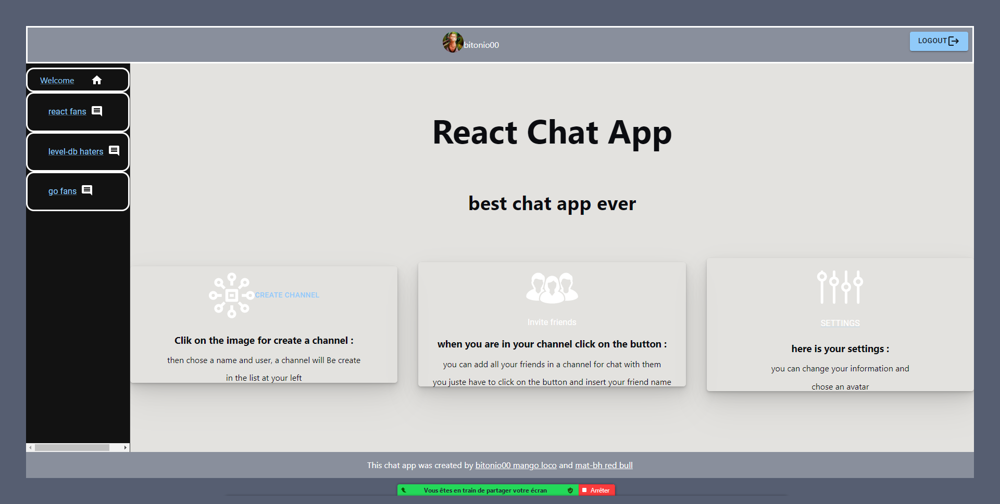
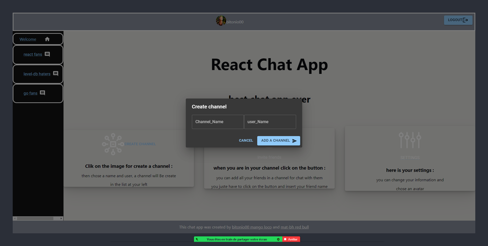
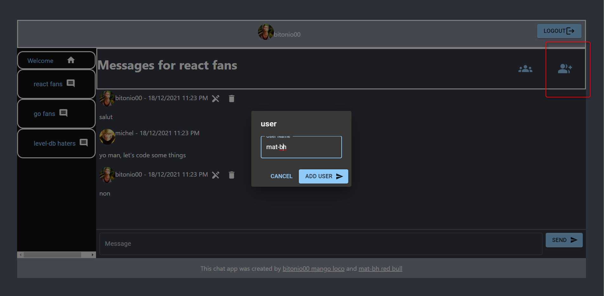
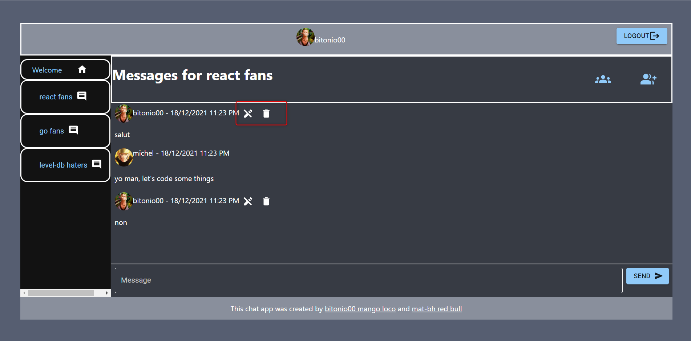
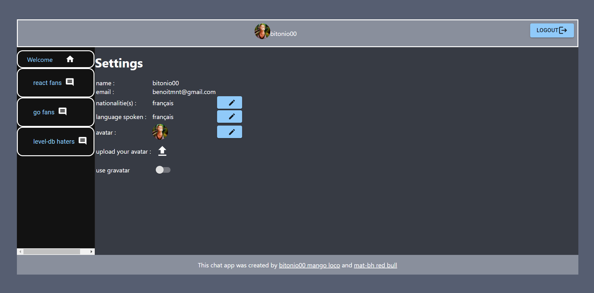

#  REACT CHAT-APP

## Introduction :

#### Ce chat a été crée avec un front-end fait avec la librairie react qui communique grâce à l'API axios avec le back-end utilisant level-db, node.js et express


## Initialisation du projet :
- Installer les dépendances du frontend :
  ```
  cd front-end && npm i && cd ..
  ```
- Installer les dépendances du backend :
  ```
  cd backend && npm i && cd ..
  ```

- Pour run le project

  ```
  "docker": "docker-compose up"
  - Faire sur deux terminales différents :
  "back-end": npm run start
  "front-end":npm run start

  ```

  Votre chat vous attendra sur http://localhost:3000, il communique avec un backend situé sur http://localhost:3001

  Il existe 3 manières de ce connecter grâce à Dex :
  - click on Log in with Email: use michel@example.com, Password: password
  - click on Log in with Example : no requirements,
  - click on Log in with GitHub: use your account

## Description :


### 2.  Fonctionalités :

#### a. Welcolm Page

Une fois connecté l'utilisateur retrouve une page d'acceuille stylisé avec du css, le user à plusieurs call to action, il peut:
- créer un nouveau channel
- accèder à ses settings
- accèder à ses channels (dans lequels il est présent)



#### b. Créer un Channel:


Un utilisateur peut créer des channels, il en devient alors un des administrateurs, il sera lui et les autres participants les seules a pouvoir y accéder et à rajouter des users en cours de route . Un utilisateur pourra donc retrouver ses propres channels ainsi que ceux ou il a été ajouté.

#### c. Ajouter un user au channel :


Les membres du channel peuvent ajouter des membres  uniquement si l'utilisateur n'est  pas déjà dans le channel. Une fois ajouté vous pouvez voir la liste des users du channel

#### d.  Messages:


Les messages sont restreints aux channels dans lesquels ils ont été envoyer.
Seul l'utilisateur qui envoie le message peux le supprimer ou bien les modifier.

#### e. Settings :


Les utilisateurs peuvent modifier les paramètres de leur profils, comme la langue ou la nationalité.


#### f.  Gravatar :

L'utilisateur peux choisir d'associer son gravatar associer à son email grâce au switch dans les settings.

#### g.  Avatar :

De base les utilisateurs ont tous le même avatar dans les settings, ils peuvent en choisir un parmis 6 proposés

#### h.  Upload Avatar :

Si les avatars proposés ne conviennent pas à l'utilisateurs il peut upload son propre avatar (le champ supporte le drag and drop lorsqu'il est ciblé sur le boutton upload)

#### f.  Channel membership and access :
done


## Informations:

Si vous rencontrez un problème, n'hésitez pas à nous contacter aux adresses suivantes :
- benoitmnt@gmail.com
- matthieu.bahani@edu.ece.fr
